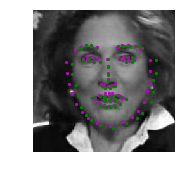
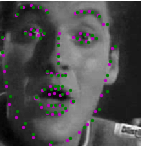
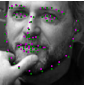
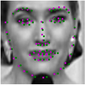

## Facial Keypoint Detection

In this project, I build a facial keypoint detection system. The system consists of a face detector that uses Haar Cascades and a Convolutional Neural Network (CNN) that predict the facial keypoints in the detected faces. The facial keypoint detection system takes in any image with faces and predicts the location of 68 distinguishing keypoints on each face.

### Important Notes
```
1. Implementation of models(i.e ResNet and NaimishNet) is at model.py
2. Details on training are covered on jupyter notebook (3.)
3. I have included the training data that I used on data/ for reproducible results
4. Two separate source code are added for running inference on webcam or images/videos 
```
Some of my output from my Facial Keypoint Detection system:</br>
**NaimishNet**
<p float="left">
  
   
  
    
</p>

**ResNet18(w Transfer learning)**
<p float="left">
  
   
  
    
</p>

Green points: Ground Truth </br>
Purple points: Predicted points by my Model
## Inference 
#### Usage

```
#Running inference on image or video
python inference.py --weights path/to/saved_weights --model (resnet or naimishnet) --img path/to/img --vid path/to/vid_file 

#Running inference in Real-time using Webcam
python inference_cam.py --weights path/to/saved_weights --model (resnet or naimishnet) --cam cam_src(DEFAULT: 0)

```

### Some fun stuff :heart:
Demo Gifs on Facial Keypoint detection on videos
<p float="left">
    
      
</p>
