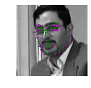
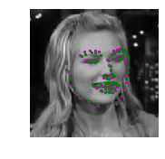
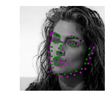

# Computer Vision Nanodegree 

This repository contains project files for Udacity's Computer Vision Nanodegree program which I enrolled on 10 August, 2019.

## Projects

### Facial Keypoint Detection
>[P1_Facial_Keypoints](https://github.com/nz-is/CVND-Projects/tree/master/P1_Facial_Keypoints)

In this project, I build a facial keypoint detection system. The system consists of a face detector that uses Haar Cascades and a Convolutional Neural Network (CNN) that predict the facial keypoints in the detected faces. The facial keypoint detection system takes in any image with faces and predicts the location of 68 distinguishing keypoints on each face.

Some of my output from my Facial Keypoint system: 
###### NaimishNet

  
   
  
    

###### ResNet18

**Green points: Ground Truth  
Purple points: Predicted points by my Model**

### Automatic Image Captioning(TODO)
>[P2_Image_captioning](https://github.com/nz-is/CVND-Projects/tree/master/P2_Image_Captioning)

In this project, I design and train a CNN-RNN (Convolutional Neural Network - Recurrent Neural Network) model for automatically generating image captions. The network is trained on the Microsoft Common Objects in COntext (MS COCO) dataset. The image captioning model is displayed below.

 [Image source](https://arxiv.org/pdf/1411.4555.pdf)

### Landmark Detection & Tracking (SLAM) (TODO)
>[P3_SLAM](https://github.com/nz-is/CVND-Projects/tree/master/P3_SLAM)

Implement Graph SLAM (Simultaneous Localization and Mapping) for a 2 dimensional world
